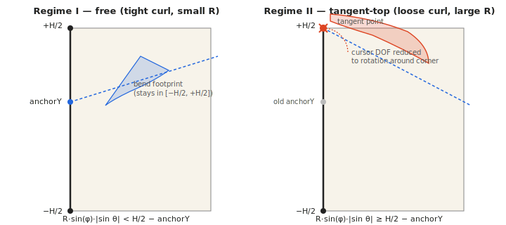

# PRD: Page model — inextensibility (developable surface)

Status: Draft
Owner: Page-turn renderer
Scope: Foundational geometric constraint that *all* page deformations
(static drag, timed turn, fan turn, settle) must satisfy. Companion to
`prd-settle-physics.md`.

## Background — what's wrong now

The inline `FLIP_VERT` shader in `src/book/Book.ts` rotates each flap
vertex by an angle that depends on its own `t`-coordinate (normalized
distance from the crease):

```
φ(t) = uAngle + 0.4 · t · sin(2 · uAngle)
```

This is a *non-rigid, per-vertex* rotation. Vertices at small `t` rotate by
nearly `uAngle`; vertices near the free edge (`t = 1`) rotate by
`uAngle + 0.4·sin(2·uAngle)`. The mesh topology and per-vertex world
positions are well-defined, but **geodesic distances along the page surface
are not preserved**. A pair of points 5 mm apart on the rest sheet can wind
up 4.7 mm or 5.4 mm apart mid-turn, depending on where they sit relative to
the crease.

A user, looking at a mid-drag screenshot, characterized this as the page
"stretching as a thin elastic surface." That is exactly right
mathematically. Paper, however, has near-zero membrane strain — it can be
bent essentially freely, but stretched essentially not at all.

## The correct constraint

Paper is well-modeled as a **developable surface**: a smooth surface with
Gaussian curvature `K = 0` everywhere. Developable surfaces are exactly
those that can be unrolled flat without stretching, and they are
characterized (in the smooth case) as planes, generalized cylinders,
generalized cones, or tangent-developable surfaces. Inspired-by (cite, do
not copy): do Carmo, *Differential Geometry of Curves and Surfaces*, §3.5
(developables); Solomon et al. 2012, "Flexible developable surfaces," for
the discrete formulation.

The continuum mechanics underpinning is the **Kirchhoff–Love thin-shell
model**, with the limit:

- Membrane stiffness `→ ∞` — the sheet resists in-plane stretch
  essentially absolutely.
- Bending stiffness `D` finite and moderate — the sheet resists, but
  permits, out-of-plane curvature.

For paper:

```
D = E · t³ / [12 · (1 − ν²)]
```

with material ranges:

| Parameter | Symbol | Range                | Notes                    |
|-----------|--------|----------------------|--------------------------|
| Young's modulus  | `E` | 2–10 GPa     | machine-direction; lower across fiber |
| Thickness        | `t` | 0.05–0.30 mm | newsprint → cardstock                 |
| Poisson ratio    | `ν` | ≈ 0.3        | typical for paper                     |
| Bending stiffness | `D` | ~ 0.2 µN·m to ~ 200 µN·m | spans 3 decades        |

This range is what makes a feather-light onion-skin Bible page curl into a
tight cylinder under its own weight, while a piece of cardstock barely sags
— the same equations, different `D`.

## Practical implication for the shader

The current `sin(2φ)` envelope is a perceptual hack: it adds lag at the
free edge to *suggest* gravity-bend, but pays for it in membrane strain.
Replace the per-vertex angle with a true rigid-body + cylindrical-curl
decomposition:

1. **Rigid rotation** of the entire flap region by `uDihedral` around the
   (tilted) crease axis. This is what `CreaseGeometry.ts` already pins —
   keep it.
2. **Cylindrical curl** layered on top: a developable cylinder whose axis
   is *parallel* to the crease and whose radius `R` is constant across the
   flap, set by the bending-stiffness parameter.

Mathematically, parameterize the flap in (s, u) coordinates where `s` is
arc-length away from the crease and `u` is along the crease. Rest position
is `x₀(s, u) = origin + s·n̂ + u·k̂` (with `n̂ ⊥ k̂` in the page plane).
The curled, lifted position is

```
x(s, u) = origin + R·sin(s/R)·n̂' + R·(1 − cos(s/R))·b̂' + u·k̂
n̂' = rigid_rot(n̂, uDihedral, k̂)
b̂' = rigid_rot(ẑ,  uDihedral, k̂)
```

This is an isometric embedding of the rest sheet — every infinitesimal
patch preserves area and every geodesic preserves length. `R = ∞`
recovers the rigid-flat-flap limit; small `R` produces a tight curl. `R`
itself is driven by the static gravity moment vs the bending stiffness
`D`, and during settle by the aerodynamic puff term defined in
`prd-settle-physics.md`.

## Why "thin elastic surface" still has merit

Inextensible does not mean rigid. The bending elasticity is what gives
paper its characteristic *curl-and-relax* behavior, and is exactly the
degree of freedom the settle physics needs. Different paper weights (gsm)
map to different `D` and therefore to different curl radii and different
relaxation timescales. Concretely:

- A heavier "cover" stock should curl less under the same gravity (larger
  `R`), and settle faster (larger `D` ⇒ stiffer restoring torque per
  unit curvature).
- A lighter "interior" page should curl more, settle slower, and flutter
  more visibly under the aerodynamic puff.

This connects directly to the aerodynamic settle PRD: the `b̈` ODE
proposed there (`b̈ = ω²·(b₀ − b) − Db·ḃ + κ·φ̇²`) becomes, under this
model, an ODE on the *cylindrical curl curvature* `1/R`, with `ω²` and
`Db` no longer free art knobs but functions of `D` and the flap
dimensions. The puff still excites curl; the puff just lives on the
developable manifold instead of an arbitrary per-vertex displacement
field.

## Functional requirements

**FR-P1. Inextensibility invariant.** At any moment during any
animation (drag, timed turn, fan turn, settle), for every pair of
fiducial markers on the lifted flap, the geodesic distance between them
on the rendered page surface shall equal their rest-configuration
geodesic distance to within 1.0% (tolerance scaled by `pageWidth`).

**FR-P2. Developable parameterization.** The flap deformation shall be
expressible as the composition of (a) a rigid rotation around the
(tilted) crease axis, and (b) a cylindrical isometry parameterized by a
single curvature scalar `1/R`. No additional per-vertex degrees of
freedom shall be introduced into the static bend.

**FR-P3. Bending-stiffness parameter.** A material parameter `D` (or
equivalently `R_min`, the tightest curl radius the page allows) shall be
exposed as a per-page-stock setting. Out of the box, two stocks are
defined: "interior" (lower `D`) and "cover" (higher `D`). Cover pages
shall visibly curl less than interior pages under identical drag input.

**FR-P4. Continuity with settle PRD.** All time-varying state defined in
`prd-settle-physics.md` (`φ`, `b`, puff, tangent drift) shall act on the
developable-surface manifold. The settle integrator shall not introduce
membrane strain.

**FR-P5. Crease region.** A small neighborhood of the crease (width
configurable, default ~ 1 mm in page-local units) is exempt from the
zero-strain constraint, since real paper folds plastically there. This
exemption is bounded and documented; it is not a license for general
non-developable deformation away from the crease.

## Bend-binding-tangent constraint

Added 2026-05-14 based on a real-paper observation. The PR #82 Option B
fix (pin `creaseAnchorY` at pointerdown) is the *Regime I* solution; this
section formalizes the *Regime II* case it does not cover.

### User observation (verbatim)

> you should note that my hand is forced to move in reaction to the bend
> hitting the constraint of the binding. I cannot continue to turn the
> page when the bend is not parallel to the binding without choosing to
> tear the page out of the binding or adjusting my hand as one end of the
> bend rotates around the top or bottom of the binding depending on where
> the bend's circumference is tangent to the binding. This is true is my
> hand is very close to the page or higher above the page. The height of
> my hand only changes the diameter of the bend in the paper, but as that
> diameter gets larger (if I have my hand high above the book) it will
> cause the circumference of the bend to become tangent the binding. In
> this case the "bend" is the surface of the dihedral.

### Geometry

In page-local coords with the spine along ŷ at x=0:
- Crease passes through `(0, anchorY)` with direction
  `k̂ = (sin θ, cos θ)`. θ is the tilt angle from the spine.
- The curl is a developable cylinder of radius `R` (set by bending
  stiffness; "hand high above the book" ⇒ larger R) with axis parallel
  to `k̂`.
- The dihedral angle `φ ∈ [0, π]` is the rigid rotation around the
  crease axis.

The curl's *lateral reach* — how far the bent paper extends in 3D
perpendicular to the crease axis — peaks at `R·sin(φ)`. Because the
crease is tilted by θ, this lateral reach projects onto the spine
direction with factor `|sin θ|`. The bend's *spine footprint* — the
y-extent the bent material consumes along the binding — therefore
extends from the crease anchor by at most

> ΔY_max(φ) = R · sin(φ) · |sin θ|.

### Two regimes

**Regime I — free.** The bend stays inside the binding extent:

> R · sin(φ) · |sin θ|  <  H/2 ∓ anchorY

(top corner: `−`; bottom corner: `+`). The crease anchor is the per-gesture
`anchorY` chosen at pointerdown (Option B, PR #82). The cursor's 2-DOF
motion freely tilts the crease and varies φ.

**Regime II — tangent.** The bend has reached the binding endpoint:

> R · sin(φ) · |sin θ|  ≥  H/2 ∓ anchorY

The crease's spine intersection migrates from `anchorY` to the binding
endpoint `(0, ±H/2)`. Further cursor motion can no longer freely tilt
the crease — the user's hand has only one degree of freedom remaining:
rotation around the corner the bend has anchored to.

The transition is symmetric in `sin θ`: `sin θ < 0` (flap leans toward
+y as φ rises) selects the **top** corner; `sin θ > 0` selects the
**bottom**.

### Closed-form critical values

Critical dihedral (where tangency first occurs, for fixed `R, θ, anchorY`):

> sin φ_crit = (H/2 ∓ anchorY) / (R · |sin θ|).

NaN when `R · |sin θ| < H/2 ∓ anchorY` (bend never reaches that corner
in a half-rotation).

Critical curl radius (for fixed θ, anchorY; tangency at φ = π/2):

> R_c = (H/2 ∓ anchorY) / |sin θ|.

For `R > R_c` tangency occurs at `φ_crit < π/2`. **Doubling R exactly
halves `sin φ_crit`** — the user's "higher hand ⇒ hits binding sooner"
observation falls directly out of the closed form.

### Numerical reproduction

With the canonical setup `anchorY = 0`, `θ = 30°` (sin θ = 0.5),
`H = 1`:

| Stock     | R    | R·sin(π/2)·\|sin θ\| | H/2 − anchorY | sin φ_crit | φ_crit  | Regime at φ = π/2 |
|-----------|------|---------------------|---------------|------------|---------|-------------------|
| interior  | 0.25 | 0.125               | 0.5           | (NaN)      | (NaN)   | free              |
| interior  | 0.6  | 0.30                | 0.5           | (NaN)      | (NaN)   | free              |
| midrange  | 1.0  | 0.50                | 0.5           | 1.000      | π/2     | boundary          |
| cover     | 2.0  | 1.00                | 0.5           | 0.500      | 0.524   | tangent-bottom    |
| very loose| 4.0  | 2.00                | 0.5           | 0.250      | 0.253   | tangent-bottom    |

The interior stock (`R = 0.25` per `DevelopableSurface.INTERIOR_STOCK`)
never reaches tangency for this anchor/tilt. The cover stock (`R = 0.9`
default) does. Doubling R from 2.0 to 4.0 halves `sin φ_crit` from
0.500 to 0.250 — confirming the user's "higher hand → tangency at
smaller turn angle."

### Functional requirements

**FR-P6. Bend-binding non-intersection.** Under any drag at any curl
radius, the bend's spine footprint shall not penetrate the binding
endpoints — the bent paper cannot pass through the cover's top or
bottom corner. When the closed-form tangent condition is met, the
crease's spine intersection shall migrate to the binding endpoint
`(0, ±H/2)` rather than continuing past it.

**FR-P7. Reduced cursor DOF in Regime II.** Once the bend is tangent
at a binding corner, the cursor's two pixel-degrees of freedom shall be
reinterpreted as one rotational degree of freedom (rotation around the
binding corner). The user's `clientX`/`clientY` continues to track their
hand; the drag-state interpretation projects the cursor onto the
feasible-drag arc (the great circle around the binding corner in the
crease-axis rotation plane).

### Side-by-side diagram

See `docs/evidence/bend-binding-tangent-regimes.svg`:



### Conceptual fix (not yet implemented)

1. Before each pointer-move, evaluate `regimeDetect()` in
   `src/book/BindingConstraint.ts`.
2. If `regime === 'free'`: apply the Option B path unchanged.
3. If `regime === 'tangent-top'` or `'tangent-bottom'`:
   - Snap the crease's spine intersection to `(0, ±H/2)`.
   - Re-derive the crease tilt so the line passes through both the
     binding corner *and* the cursor's projection onto the page plane.
   - Translate further cursor motion into rotation around the binding
     corner: `φ` in Regime II is the angle from the corner to the cursor
     measured in the rotation plane perpendicular to the crease axis.
4. The transition is detected by `tangentMargin` crossing zero. A small
   hysteresis band may be useful to avoid jitter at the boundary.

This module ships only the analytic detector; the renderer/state
integration is the follow-up PR.

## Acceptance criteria / Validation

The 35-fiducial trajectory dataset (`harness/baselines/`, 5×7 grid at
known UVs in `src/textures/atlas.ts`) is the natural test bed:

1. **Pairwise geodesic invariant.** Extend the harness runner to compute,
   per frame, the pairwise straight-line distance between fiducials in
   page-local 3D space (which equals geodesic distance on a developable
   surface up to the bend angle they straddle, in the small-patch limit).
   The frame-to-rest ratio shall lie in `[0.99, 1.01]` for all pairs not
   straddling the crease exemption zone (FR-P5).
2. **Curl-radius regression.** New scenarios `static-cover-stock` and
   `static-interior-stock` apply identical drag to two materials; assert
   the measured free-edge displacement differs by the ratio predicted by
   `D_cover / D_interior`.
3. **Visual regression.** Capture the post-change `sin2phi → developable`
   diff into `harness/baselines/developable/` per the existing baseline
   workflow in `harness/baselines/README.md`. Document the per-fiducial
   trajectory delta (the change is expected to be > the inter-frame
   noise floor, so a numeric diff is informative not pass/fail).

## Non-goals

- Plastic deformation (creases that persist after release). The crease
  exemption FR-P5 is a static modeling allowance, not a plasticity model.
- Tear / puncture mechanics.
- Anisotropic paper (machine vs cross direction stiffness). `D` is
  scalar in v1.
- Self-collision of the page with itself (e.g., a curl tight enough to
  touch its own back face). The cylindrical model can produce such
  configurations but we do not resolve them.
- Multi-layer laminates, folded inserts, etc.

## Open questions

1. The `CreaseGeometry.ts` model already defines a *tilted* crease axis.
   Cylindrical curl whose axis is parallel to the crease is unambiguous
   in the spine-aligned case but needs care when `creaseDir` tilts —
   does the curl axis tilt with it (most physically defensible) or stay
   spine-aligned (simpler)?
2. Should `R` be uniform across the flap (true cylinder) or allowed to
   vary along the crease direction (still developable as a generalized
   cylinder, but more parameters)? Uniform is the proposed v1.
3. How is the crease-exemption zone (FR-P5) implemented — a UV-space
   mask in the shader, or a geometric blend in the parameterization?
4. Does the popup diorama (`POPUP_SPREAD = 7`) need its own
   developable model, or are popup folds rigid?
5. Is `D` exposed as a per-page (per-spread) parameter, or globally per
   book? Per-page enables a heavier cover than interior, which is
   physically realistic and visually desirable.

## Implementation hints (non-binding)

- **`src/book/Book.ts`** — replace the `FLIP_VERT` formula with the
  cylindrical-curl parameterization. The new shader needs `uCurlRadius`
  (or equivalent) plus the existing crease uniforms.
- **`src/book/CreaseGeometry.ts`** — likely gains a helper that takes a
  drag point and returns `(uDihedral, uCurlRadius)` jointly, replacing
  the current scalar mapping.
- **New `src/book/PageMaterial.ts` (or extend `BookMaterial`)** — owns
  the `D`, `t`, `E`, `ν` parameters per page stock.
- **`src/main.ts`** — no direct change required; the settle integrator
  proposed in `prd-settle-physics.md` continues to operate on `(φ, b)`,
  with `b` reinterpreted as `1/R`.
- The change is large enough that a feature flag is recommended, with
  the `sin2phi` shader path retained until the developable path passes
  the FR-P1 invariant on every baseline scenario.
